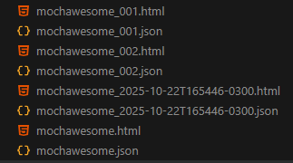

## Banco API Tests 🧪
📘 Descrição

O projeto Banco API Tests tem como objetivo realizar testes automatizados de API REST para o projeto Banco API.
Utilizando a linguagem JavaScript, o foco é validar endpoints da aplicação, garantindo o correto funcionamento das rotas principais como autenticação, cadastro e transações bancárias.

## 🎯 Objetivo

O propósito deste projeto é demonstrar na prática a criação, execução e relatório de testes automatizados de API, utilizando Mocha, Chai e Supertest.
Além disso, o projeto visa servir como referência de estruturação de testes de integração para aplicações Node.js, com foco em:

 * Organização clara dos diretórios e scripts de teste.

 * Configuração simples via .env.

 * Geração automática de relatórios legíveis com Mochawesome.

## ⚙️ Stack Utilizada

 * O projeto faz uso das seguintes tecnologias e bibliotecas:

 * JavaScript (Node.js) — linguagem principal.

 * [Mocha](https://mochajs.org/) — framework de testes JavaScript.

 * [Chai](https://www.chaijs.com/) — biblioteca de asserções para testes.

 * [Supertest](https://github.com/ladjs/supertest) — ferramenta para testes de integração HTTP.

 * [Mochawesome](https://www.npmjs.com/package/mochawesome) — geração de relatórios em HTML e JSON.
 
 * Gerenciamento de variáveis de ambiente: [dotenv](https://github.com/motdotla/dotenv) 

 * Outras dependências podem ser consultadas diretamente no arquivo package.json.

## 📂 Estrutura do Projeto
```
banco-api-tests/
├── test/               # Testes organizados por funcionalidades
│   ├── login.test.js
│   └── transferencias.test.js
├── mochawesome-report/ # Diretório gerado automaticamente com o relatório HTML dos testes
├── .env                # Arquivo para configuração da variável BASE_URL
├── .gitignore
├── package.json
└── README.md
```

## Formato do arquivo .env
Antes de rodar os testes, crie um arquivo chamado .env na raiz do projeto com o seguinte conteúdo:
```
BASE_URL=http://localhost:3000
```
Substitua http://localhost:3000 pela variável BASE_URL onde a URL estiver definida como parâmetro.

## 🚀 Como executar o projeto

1. **Clonar o repositório**
    ```bash
    git clone https://github.com/cassiopatrizzi/banco-api-tests.git
    cd banco-api-tests
    ```

2. **Instalar as dependências**
    ```bash
    npm install
    ```

3. **Executar os testes**
    ```bash
    npm test
    ```
4. Geração automática do relatório HTML:

Após executar npm test, o relatório será gerado dentro da pasta mochawesome-report/.
## Sugestão: para executar os testes e abrir o relatório HTML automaticamente, adicione um script no package.json
 * Manter a base limpa e injetar as opções de reporter após o Mocha.
```
"scripts": {
  "test:base": "mocha ./test/**/*.test.js --timeout=200000 --reporter mochawesome",
  "test": "npm run test:base",
  "test:report-open": "npm run test:base -- --reporter-options autoOpen=true,overwrite=false"
}
```
```bash
npm run test:report-open
```
Caso queira gerar aquivos com nomes únicos, adicione o 'overwrite=false'. Adicionando o 'timestamp=true' além do overwrite, são gerados arquivos únicos com a data e o horário (nesse caso o overwrite mesmo sendo true, será ignorado).

